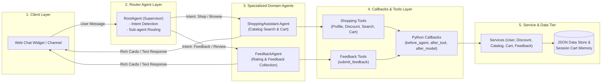
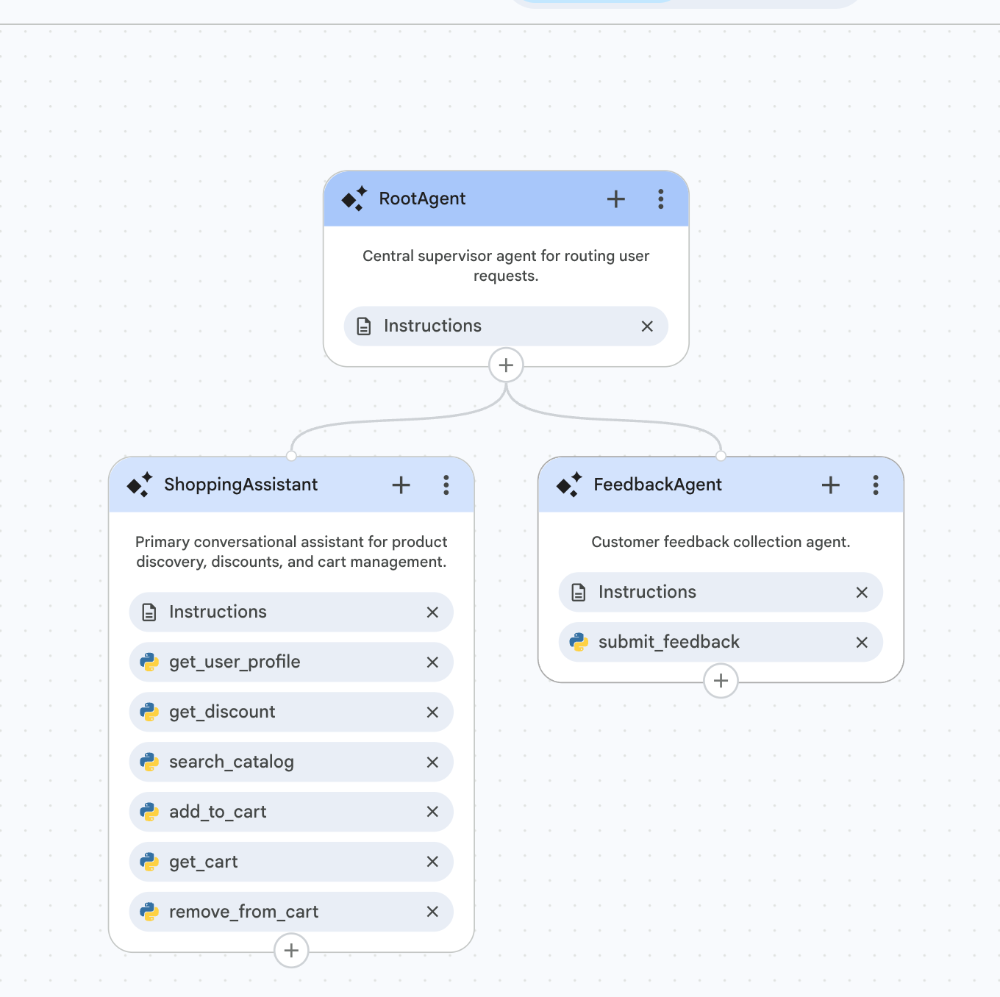
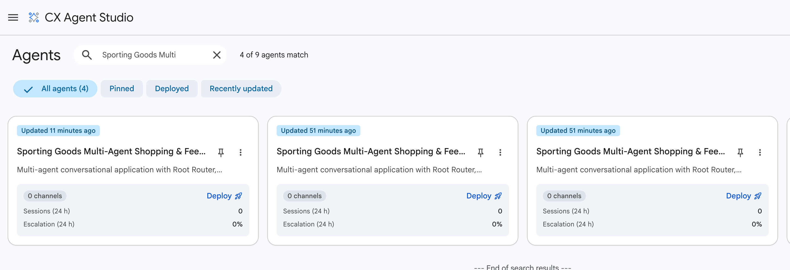

# Sporting Goods Multi-Agent Shopping & Feedback Assistant

A multi-agent conversational application for a sporting goods storefront (shoes, apparel, equipment) built on **Customer Experience Agent Studio (CX Agent Studio)** — part of **Gemini Enterprise for Customer Experience** — and managed programmatically using **`cxas-scrapi`** (`GoogleCloudPlatform/cxas-scrapi`).

---

## 🌟 Overview & Key Features

The application features a **Multi-Agent Router Architecture** driven by natural-language XML instructions, Python code tools, execution callbacks, dynamic session variables, and a pluggable service abstraction layer:

- **Root Router Agent (`RootAgent`)**: Central supervisor that detects customer intent and routes between shopping discovery and customer feedback.
- **Shopping Assistant (`ShoppingAssistant`)**: Greets members, surfaces membership-tier discounts, searches product catalogs based on natural-language queries, and manages session shopping carts.
- **Customer Feedback Agent (`FeedbackAgent`)**: Collects 1 to 5 star ratings and customer feedback comments, logging them into analytics.
- **App-level Guardrails**: Centrally manages security using Custom Prompt Guards (jailbreak/injection filters), deterministic Blocklists (PII, competitor brands, and profanity), and natural-language Rules across all agents.
- **Logging & Observability**: Configured Cloud Logging with 1-year retention and automatic BigQuery analytics export to analyze conversation flows, intent statistics, and user interactions.
- **Persistent User Memory (Firestore)**: A Cloud Run microservice backed by Firestore stores durable, natural-language facts about each user — preferences, interests, and past interaction summaries — recalled via `fetch_user_profile` and written via `add_user_memory`, so future sessions can give better recommendations. The live shopping cart itself stays session-scoped and is never persisted.
- **Membership Discount Engine**: Automatically applies member discounts (**Gold: 15%**, **Silver: 10%**, **Bronze: 5%**, **Guest: 0%**) to product prices and cart totals.
- **Server-Side Pricing Math**: Calculates exact float arithmetic for cart subtotals, discount amounts, and grand totals server-side via callback functions.
- **Rich Response Widgets**: Renders product recommendations and cart line items as structured, image-bearing Info Card UI widgets.
- **Service Abstraction Layer**: Data access is isolated behind `IUserService`, `IDiscountService`, `ICatalogService`, `ICartService`, and `IFeedbackService` interfaces — currently backed by mock JSON files, ready to swap for real REST/OpenAPI backends.
- **CI/CD & Environment Promotion**: Fully configured GitHub Actions workflows for continuous integration quality gates (`.github/workflows/ci.yml`) and multi-environment deployment (`.github/workflows/cd.yml`).

---

## 🏗️ Architecture Diagram



---

## 📁 Repository Structure

```
ShoppingAssistantAgent/
├── Shopping-Assistant-Agent-PRD.md  # Product Requirements Document
├── Shopping-Assistant-Agent-TDD.md  # Technical Design Document (TDD v2.1)
├── README.md                        # Project Documentation
├── app.json                         # CX Agent Studio Application Manifest (RootAgent)
├── pyproject.toml                   # Project dependencies and test config
├── gecx-config.toml                 # Multi-Environment Deployment Profiles (dev, staging, prod)
├── .github/
│   └── workflows/
│       ├── ci.yml                   # CI Quality Gate (cxas lint, validate_schemas, pytest, evals)
│       └── cd.yml                   # CD Deployment (GCP Workload Identity promotion)
├── agents/
│   ├── RootAgent/
│   │   ├── RootAgent.json           # RootAgent manifest & sub-agent bindings
│   │   ├── instruction.txt          # Supervisor routing system prompt (<role>, <step>)
│   │   └── before_agent_callbacks/  # Hook: Seeding user_id/user_name defaults for RootAgent
│   ├── ShoppingAssistant/
│   │   ├── ShoppingAssistant.json   # ShoppingAssistant manifest, tools & toolsets
│   │   ├── instruction.txt          # Product discovery, cart & memory-write prompt (<role>, <step>)
│   │   ├── before_agent_callbacks/  # Hook: Seeding context for ShoppingAssistant
│   │   ├── before_tool_callbacks/   # Hook: Argument sanitization
│   │   ├── after_tool_callbacks/    # Hook: Server-side cart arithmetic & feedback state
│   │   └── after_model_callbacks/   # Hook: Rich Info Card payload formatting
│   └── FeedbackAgent/
│       ├── FeedbackAgent.json       # FeedbackAgent manifest, tools & toolsets
│       ├── instruction.txt          # Feedback collection & memory-write prompt (<role>, <step>)
│       ├── before_agent_callbacks/  # Hook: Seeding context for FeedbackAgent
│       └── after_tool_callbacks/    # Hook: Verification after feedback submission
├── tools/                            # CXAS pythonFunction / clientFunction tools (self-contained, sandboxed)
│   ├── get_discount/
│   │   ├── get_discount.json
│   │   └── python_function/python_code.py
│   ├── search_catalog/
│   │   ├── search_catalog.json
│   │   └── python_function/python_code.py
│   ├── add_to_cart/
│   │   ├── add_to_cart.json
│   │   └── python_function/python_code.py
│   ├── get_cart/
│   │   ├── get_cart.json
│   │   └── python_function/python_code.py
│   ├── remove_from_cart/
│   │   ├── remove_from_cart.json
│   │   └── python_function/python_code.py
│   ├── submit_feedback/
│   │   ├── submit_feedback.json
│   │   └── python_function/python_code.py
│   └── end_session/
│       └── end_session.json        # CXAS Client Tool Manifest (clientFunction)
├── toolsets/                         # CXAS OpenAPI toolsets — platform-executed HTTP calls (not sandboxed)
│   ├── fetch_user_profile/
│   │   ├── fetch_user_profile.json           # Toolset manifest (openApiToolset)
│   │   └── open_api_toolset/open_api_schema.yaml  # GET /api/v1/users/{user_id}
│   └── add_user_memory/
│       ├── add_user_memory.json
│       └── open_api_toolset/open_api_schema.yaml  # POST /api/v1/users/{user_id}/memories
├── microservice/                     # FastAPI + Firestore backend for fetch_user_profile / add_user_memory
│   ├── main.py                      # REST endpoints consumed by the OpenAPI toolsets above
│   ├── firestore_service.py         # Firestore read/write layer
│   ├── Dockerfile / deploy.sh       # Cloud Run deployment (`shopping-user-service`)
│   └── test_main.py                 # Microservice unit tests (pytest)
├── services/
│   ├── interfaces.py                # Abstract Base Classes for services
│   ├── user_service.py              # User service implementation
│   ├── discount_service.py          # Discount service implementation
│   ├── catalog_service.py           # Product catalog service implementation
│   ├── cart_service.py              # Session cart service implementation
│   └── feedback_service.py          # Customer feedback service implementation
├── data/
│   ├── mock_users.json              # Mock user profile database
│   ├── membership_discounts.json    # Membership tier discount mapping
│   ├── mock_catalog.json            # Mock product catalog with images
│   └── mock_feedback.json           # Persistent feedback store
├── evaluations/                      # CXAS SCRAPI official evaluation definitions & runner
│   ├── tc_01_gold_greeting/
│   │   └── tc_01_gold_greeting.json # Golden evaluation definition
│   ├── tc_06_guest_user_flow/
│   │   └── tc_06_guest_user_flow.json # Scenario evaluation definition
│   ├── tc_08_end_to_end_multi_agent_journey/
│   │   └── tc_08_end_to_end_multi_agent_journey.json # Scenario evaluation definition
│   └── run_evals.py                 # Local multi-agent simulation evaluation runner
├── tests/
│   └── test_services.py             # Unit test suite (unittest)
└── scripts/
    ├── build_app.py                 # cxas-scrapi multi-environment deployer (dev, staging, prod); also
    │                                 # re-applies agent↔toolset bindings after push (see below)
    ├── push_all_evals.py            # Syncs all Golden & Scenario evals to CXAS
    ├── test_interactive_session.py  # Interactive multi-agent demo simulation
    └── validate_schemas.py          # Schema & manifest validation script
```

---

## 🛡️ Guardrails & Global Observability Settings

All guardrail boundaries and analytics logging settings are defined globally at the application level in `app.json`.

### 1. Guardrail Configurations
- **Blocklist**: Deterministic redaction of competitor brand names (`Nike`, `Adidas`, etc.) from agent responses, and sensitive user inputs (Credit Card regex, SSN regex, and basic profanity).
- **Custom Prompt Guard**: Screening model input against jailbreak / injection attempts to block off-topic prompt overrides.
- **Natural Language Rules**: 7 LLM-evaluated behavioral policies ensuring transaction security, strict product alignment, and preventing incorrect discount applications or medical advice.

### 2. Global Logging & Storage
- **Cloud Logging**: Streams turn-by-turn trace entries to Google Cloud Logging (`enableCloudLogging: true`).
- **BigQuery Export**: Automatically streams conversation histories to `shopping_assistant_logs` for analytics.

---

## 🧠 Persistent User Memory (Firestore)

**Design principle:** the live shopping cart is session-scoped only (CXAS session state, `{cart}`) and is *never* written to Firestore. Firestore exists solely to hold durable, natural-language *knowledge* about a user — preferences, interests, and interaction summaries — so future sessions can give better recommendations. This intentionally keeps the two concerns (transient cart state vs. durable user knowledge) separate and avoids syncing the cart on every add/remove.

### 1. Read & write paths
- **`fetch_user_profile`** (`toolsets/fetch_user_profile/`, OpenAPI toolset): called at the start of a `ShoppingAssistant` session with `user_id`, returns `user_name`, `membership_tier`, and `memories: []` — a list of short facts from past sessions — which seed `{long_term_memories}` for the model to reference.
- **`add_user_memory`** (`toolsets/add_user_memory/`, OpenAPI toolset): called by the model to append one new natural-language fact to that same list. Bound to both `ShoppingAssistant` and `FeedbackAgent`.
- Both wrap REST endpoints on the `shopping-user-service` Cloud Run microservice (`microservice/`), which reads/writes the `user_profiles` collection in Firestore.

### 2. When memory gets written
Because writes must be explicit model-invoked tool calls (see the sandboxing note below — a callback cannot make this HTTP call itself), the instructions trigger `add_user_memory` at natural, reliably-detectable conversation milestones rather than on every action:
- **`FeedbackAgent`**, right after `submit_feedback` succeeds — a deterministic, always-fires trigger — writes a fact summarizing the rating/sentiment.
- **`ShoppingAssistant`**, when the user signals they're wrapping up the session (goodbye, "that's all", etc.) — writes one consolidated fact about what was browsed/added to cart this session, only if there was meaningful activity.

### 3. Example
*Session 1*: user `u_1030` (Jordan, Silver) adds a StormFlex jacket to cart, then says goodbye. `ShoppingAssistant` calls `add_user_memory` with: *"Jordan (Silver member) showed interest in the StormFlex Waterproof Trail Jacket and added it to the cart."*
*Session 2*: a new session for `u_1030` calls `fetch_user_profile`, which returns that fact in `memories`, letting the assistant reference it for personalized recommendations — without ever having persisted the cart itself.

---

## 🛠️ CXAS Platform Architecture & Self-Contained Python Tools

### 1. Isolated Google Cloud Execution Sandbox
In **Gemini Enterprise for Customer Experience (CX Agent Studio / CES API)**, Python tools defined via `pythonFunction` run in an isolated execution sandbox hosted on Google Cloud.
- **Self-Contained Tool Requirement**: Tool source files (`tools/<tool_name>/python_function/python_code.py`) MUST be self-contained and use standard Python libraries (`typing`, `json`, `datetime`, `random`, `math`). External local module imports (such as `from services...`) cause GCP's Python parser to fail with `400 Bad Request: No module named 'services'`, which prevents tools from being registered in Agent Studio.
- **Embedded Mock Data**: Tools include inline mock data fallback structures for catalog, user profile, discount rates, cart memory, and feedback logging to ensure 100% standalone reliability on GCP while maintaining compatibility with local unit test suites.
- **No outbound network access**: this sandbox (and the callback execution environment — `before_agent`/`after_tool`/etc. are plain Python running the same way) has *zero* egress — confirmed by direct testing: any `urllib`/`requests` call from inside a `pythonFunction` or callback fails immediately with DNS resolution or "network unreachable" errors, regardless of target host. Any call to an external HTTP API (like the Firestore microservice) **must** go through a CXAS OpenAPI tool/toolset instead — that's a platform-native call executed outside the sandbox, not sandboxed Python code. This is why `fetch_user_profile` and `add_user_memory` are `toolsets/` OpenAPI resources rather than `pythonFunction` tools that just call `requests.post(...)`.

### 2. OpenAPI Tools vs. Toolsets (`toolsets/`)
Wrapping an external REST endpoint for CXAS to call requires care — the two resource shapes are easy to conflate and the platform doesn't clearly error on the wrong one:
- A **`Tool`** (lives under `tools/<name>/`) has an `openApiTool` field (singular) for a *single* HTTP operation.
- A **`Toolset`** (lives under `toolsets/<name>/`, schema at `toolsets/<name>/open_api_toolset/open_api_schema.yaml`) has an `openApiToolset` field and can expose *multiple* operations from one schema. In practice, pushing an OpenAPI-based tool config always gets created server-side as a `Toolset` (confirmed empirically), regardless of which field name was used locally — so OpenAPI tools in this repo consistently live under `toolsets/`, not `tools/`.
- The resolved tool name the model actually calls is `{toolset_name}_{operationId}` (e.g. `fetch_user_profile_fetch_user_profile`) — that compound name is what `instruction.txt`'s `{@TOOL: ...}` placeholders must reference.
- Binding a toolset to an agent uses the agent manifest's separate `toolsets` array (`[{"toolset": "<name>", "toolIds": ["<operationId>"]}]`), **not** the `tools` array — a plain tool-name string there will hard-fail the push with `Reference '<name>' of type 'ces.googleapis.com/Tool' not found.`
- **Schema gotcha**: a request-body property typed as a schemaless `{"type": "object"}` silently arrives as `{}` server-side — the platform's OpenAPI executor only forwards fields it can resolve through explicit nested `properties`. Any object-typed request body field needs its full shape spelled out in the schema (see `toolsets/add_user_memory/open_api_toolset/open_api_schema.yaml` for a worked example) or the actual data gets dropped in transit while the call still reports success.

### 3. Native SCRAPI Deployment Pipeline (`scripts/build_app.py`)
Deploying an application via `python scripts/build_app.py --env <dev|staging|prod>` (or via GitHub Actions CD) executes a two-phase process:
1. **Pre-Flight Quality Gates**: Automatically cleans `__pycache__`, executes the unit test suite (`python -m unittest discover tests/`), and runs schema validation (`scripts/validate_schemas.py`). If any test fails, deployment is aborted before reaching GCP.
2. **Native SCRAPI CLI Push (`cxas push`)**: Resolves the target app resource path (`projects/{project}/locations/{location}/apps/{app_id}`) from `gecx-config.toml` and delegates synchronization directly to the native `cxas push` CLI toolchain.
3. **Toolset Binding Reconciliation**: `cxas push`'s bulk import correctly creates/updates `Toolset` resources but silently drops each agent's `toolsets` binding declared in its manifest (a known gap in the current `cxas-scrapi` bulk-import path). `build_app.py` re-applies these bindings after every push via a direct Agent Service API call (`update_agent` with an explicit field mask), reading the `toolsets` array straight out of each `agents/*/*.json`. This step is generic — any agent/toolset pair declared in the manifests gets reconciled automatically, no script changes needed when adding a new toolset.

### 4. CXAS Session Variable Mutation Patterns
State persistence across agents and turns follows specific CXAS platform rules:
- **App-Scoped State**: All session variables (such as `cart`, `user_name`, `membership_tier`) are declared globally at the App level (`app.json`). Once declared, state is shared transparently across Root and sub-agents during handoffs.
- **Tool State Mutation via `context.state`**: Python tools must explicitly mutate state using `context.state["cart"] = cart` (or `set_variable("cart", cart)`). Returning dictionary payloads containing `{"updatedVariables": ...}` alone does not persist state across turns in the CXAS Agent Engine runtime.
- **Robust Callback State Helpers**: Callback helper functions (`get_state`, `set_state_var`) must handle both standard Python `dict` types and CXAS runtime mapping objects (`MapComposite`, `State`). State setters must avoid returning early when encountering dictionary targets so that updates commit directly to `callback_context.state`.

---

## 🚀 Quick Start & Local Setup

### 1. Prerequisites
- Python `3.10` or higher
- Git
- `astral-uv`

### 2. Installation
Clone the repository and initialize the virtual environment:
```bash
uv venv --python 3.10
uv pip install -e .
```

---

## 🧪 Testing & Verification

### Run CXAS Deterministic Linter
Validates directory layout, protobuf schemas, tool configurations, and prompt structure (Target: 0 errors):
```bash
uv run cxas lint
```

### Run Schema & Manifest Validation
Validates `app.json`, agent JSON manifests, `instruction.txt` files, and JSON data files:
```bash
uv run python scripts/validate_schemas.py
```

### Run Unit Test Suite
Executes unit tests for services, tools, and callback logic:
```bash
uv run python -m unittest discover tests/
```

### Run Microservice Unit Tests
Executes tests for the Firestore-backed `shopping-user-service` (`fetch_user_profile` / `add_user_memory` backend):
```bash
cd microservice && pip install -r requirements.txt && pytest test_main.py
```

### Run Scenario Evaluations & Multi-Turn Simulations
Executes 9 automated evaluation test cases covering member tier greetings (Gold, Silver, Bronze, Guest), catalog searches, server-side cart pricing & item removals, feedback submissions, and end-to-end multi-agent journey flows:
```bash
uv run python evaluations/run_evals.py
```


### Push Evaluations to CXAS Studio
Push individual evaluations or all Golden and Scenario evaluations to CX Agent Studio:
```bash
# Push an individual evaluation file via SCRAPI CLI
uv run cxas push-eval --app_name projects/ecom-cx-agent/locations/us/apps/shopping-assistant-app-dev \
    --file evaluations/tc_06_guest_user_flow/tc_06_guest_user_flow.json

# Push all Golden & Scenario evaluations
uv run python scripts/push_all_evals.py projects/ecom-cx-agent/locations/us/apps/shopping-assistant-app-dev
```

### Run Interactive Multi-Agent Demo
Simulates an interactive customer turn-by-turn conversation:
```bash
uv run python scripts/test_interactive_session.py
```

### Run Live Routing Smoke Test
`run_evals.py` only simulates ShoppingAssistant's own callback chain locally — it never exercises RootAgent's actual routing/transfer behavior. This script drives real conversation turns against a *deployed* app via the CES Sessions API and checks that RootAgent transfers greetings and shop/feedback intent to the right sub-agent. Needs live GCP credentials and burns model quota, so it's not wired into CI — run manually after changing any `agents/*/instruction.txt` or `agents/*/*.json`:
```bash
uv run python scripts/smoke_test_routing.py --env dev
```

---

## 🔐 Keyless Authentication Setup (GCP Workload Identity Federation)

To enable automated CD deployment via GitHub Actions without storing long-lived service account keys:

```bash
# 1. Set variables
export PROJECT_ID="ecom-cx-agent"
export REPO="Sunilrana1978/ShoppingAssistantagent"
export SA_NAME="github-actions-deployer"
export POOL_NAME="github-pool"
export PROVIDER_NAME="github-provider"

# 2. Get GCP Project Number
export PROJECT_NUM=$(gcloud projects describe $PROJECT_ID --format="value(projectNumber)")

# 3. Create Service Account & Grant IAM Roles
gcloud iam service-accounts create $SA_NAME --project=$PROJECT_ID --display-name="GitHub Actions Deployer"
gcloud projects add-iam-policy-binding $PROJECT_ID --member="serviceAccount:${SA_NAME}@${PROJECT_ID}.iam.gserviceaccount.com" --role="roles/dialogflow.admin"
gcloud projects add-iam-policy-binding $PROJECT_ID --member="serviceAccount:${SA_NAME}@${PROJECT_ID}.iam.gserviceaccount.com" --role="roles/aiplatform.admin"

# 4. Create Workload Identity Pool & OIDC Provider
gcloud iam workload-identity-pools create $POOL_NAME --project=$PROJECT_ID --location="global" --display-name="GitHub Actions Pool"

gcloud iam workload-identity-pools providers create-oidc $PROVIDER_NAME \
    --project=$PROJECT_ID --location="global" --workload-identity-pool=$POOL_NAME \
    --display-name="GitHub Provider" \
    --attribute-mapping="google.subject=assertion.sub,attribute.actor=assertion.actor,attribute.repository=assertion.repository" \
    --attribute-condition="assertion.repository == '$REPO'" \
    --issuer-uri="https://token.actions.githubusercontent.com"

# 5. Bind Service Account to GitHub Repository
gcloud iam service-accounts add-iam-policy-binding "${SA_NAME}@${PROJECT_ID}.iam.gserviceaccount.com" \
    --project=$PROJECT_ID \
    --role="roles/iam.workloadIdentityUser" \
    --member="principalSet://iam.googleapis.com/projects/${PROJECT_NUM}/locations/global/workloadIdentityPools/${POOL_NAME}/attribute.repository/${REPO}"

# 6. Set GitHub Repository Secrets
gh secret set GCP_SA_EMAIL --body "${SA_NAME}@${PROJECT_ID}.iam.gserviceaccount.com" --repo $REPO
gh secret set GCP_WIF_PROVIDER --body "projects/${PROJECT_NUM}/locations/global/workloadIdentityPools/${POOL_NAME}/providers/${PROVIDER_NAME}" --repo $REPO
```

---

## 🚢 Deployment to GCP (`ecom-cx-agent`, region: `us`)

### Method 1: Automated Deployment via GitHub Actions (Recommended)
- **Deploy to STAGING**: Merge your Pull Request or push commits to `main`. GitHub Actions automatically authenticates via WIF and deploys to `ecom-cx-agent` (`shopping-assistant-app-staging`).
- **Deploy to PRODUCTION**: Create a Git release tag (e.g., `git tag v1.0.0 && git push origin v1.0.0`). GitHub Actions automatically deploys to `ecom-cx-agent` (`shopping-assistant-app-prod`).

### Method 2: Deployment via Terminal CLI / Script
```bash
# 1. Authenticate with Google Cloud
gcloud auth application-default login
gcloud config set project ecom-cx-agent

# 2. Deploy to DEV environment
uv run python scripts/build_app.py --env dev
# or: uv run cxas push --to projects/ecom-cx-agent/locations/us/apps/shopping-assistant-app-dev

# 3. Deploy to STAGING environment
uv run python scripts/build_app.py --env staging
# or: uv run cxas push --to projects/ecom-cx-agent/locations/us/apps/shopping-assistant-app-staging

# 4. Deploy to PROD environment
uv run python scripts/build_app.py --env prod
# or: uv run cxas push --to projects/ecom-cx-agent/locations/us/apps/shopping-assistant-app-prod
```

---

## 📸 Screenshots

### 1. Multi-Agent Connection Graph in CX Agent Studio


### 2. Deployed Applications List (dev, staging, prod)


---

## 📝 Document References
- [Product Requirements Document (PRD)](file:///Users/sunilkumar/gcp/ShoppingAssistantAgent/Shopping-Assistant-Agent-PRD.md)
- [Technical Design Document (TDD v2.1)](file:///Users/sunilkumar/gcp/ShoppingAssistantAgent/Shopping-Assistant-Agent-TDD.md)

