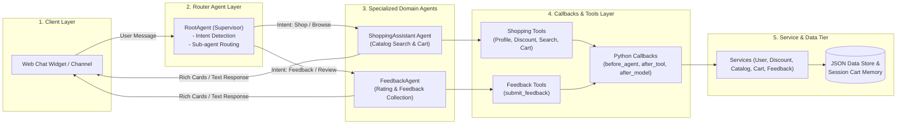

# Sporting Goods Multi-Agent Shopping & Feedback Assistant

A multi-agent conversational application for a sporting goods storefront (shoes, apparel, equipment) built on **Customer Experience Agent Studio (CX Agent Studio)** — part of **Gemini Enterprise for Customer Experience** — and managed programmatically using **`cxas-scrapi`** (`GoogleCloudPlatform/cxas-scrapi`).

---

## 🌟 Overview & Key Features

The application features a **Multi-Agent Router Architecture** driven by natural-language XML instructions, Python code tools, execution callbacks, dynamic session variables, and a pluggable service abstraction layer:

- **Root Router Agent (`RootAgent`)**: Central supervisor that detects customer intent and routes between shopping discovery and customer feedback.
- **Shopping Assistant (`ShoppingAssistant`)**: Greets members, surfaces membership-tier discounts, searches product catalogs based on natural-language queries, and manages session shopping carts.
- **Customer Feedback Agent (`FeedbackAgent`)**: Collects 1 to 5 star ratings and customer feedback comments, logging them into analytics.
- **Membership Discount Engine**: Automatically applies member discounts (**Gold: 15%**, **Silver: 10%**, **Bronze: 5%**, **Guest: 0%**) to product prices and cart totals.
- **Server-Side Pricing Math**: Uses `after_tool_callback` Python hooks to calculate exact float arithmetic for cart subtotals, discount amounts, and grand totals server-side.
- **Rich Response Widgets**: Renders product recommendations and cart line items as structured, image-bearing Info Card UI widgets.
- **Service Abstraction Layer**: Data access is isolated behind `IUserService`, `IDiscountService`, `ICatalogService`, `ICartService`, and `IFeedbackService` interfaces — currently backed by mock JSON files, ready to swap for real REST/OpenAPI backends.
- **CI/CD & Environment Promotion**: Fully configured GitHub Actions workflows for continuous integration quality gates (`.github/workflows/ci.yml`) and multi-environment deployment (`.github/workflows/cd.yml`).

---

## 🏗️ Architecture Diagram



---

## 📁 Repository Structure

```
ShoppingAssistantAgent/
├── Shopping-Assistant-Agent-PRD.md  # Product Requirements Document
├── Shopping-Assistant-Agent-TDD.md  # Technical Design Document (TDD v2.0)
├── README.md                        # Project Documentation
├── app.json                         # CX Agent Studio Application Manifest
├── pyproject.toml                   # Project dependencies and test config
├── .github/
│   └── workflows/
│       ├── ci.yml                   # CI Quality Gate (Schema linting, pytest, evals)
│       └── cd.yml                   # CD Deployment (GCP Workload Identity promotion)
├── environments/
│   ├── dev.environment.json         # Dev environment target config
│   ├── staging.environment.json     # Staging environment target config
│   └── prod.environment.json        # Production environment target config
├── agents/
│   ├── root_agent/
│   │   ├── agent.json               # RootAgent manifest & sub-agent bindings
│   │   ├── instructions.xml         # Supervisor routing system prompt
│   │   └── variables.json           # Router variables schema
│   ├── shopping_assistant/
│   │   ├── agent.json               # ShoppingAssistant manifest & tools
│   │   ├── instructions.xml         # Product discovery & cart system prompt
│   │   └── variables.json           # Shopping variables schema
│   └── feedback_agent/
│       ├── agent.json               # FeedbackAgent manifest & tools
│       ├── instructions.xml         # Feedback collection system prompt
│       └── variables.json           # Feedback variables schema
├── tools/
│   ├── get_user_profile.py          # Python tool: User profile lookup
│   ├── get_discount.py              # Python tool: Membership discount lookup
│   ├── search_catalog.py            # Python tool: Catalog search & filtering
│   ├── add_to_cart.py               # Python tool: Add item SKU/qty to session cart
│   ├── get_cart.py                  # Python tool: Active cart details & totals
│   ├── remove_from_cart.py          # Python tool: Cart item removal
│   └── submit_feedback.py           # Python tool: Submit star rating & comments
├── callbacks/
│   ├── before_agent.py              # Hook: Context seeding from channel payload
│   ├── after_tool.py                # Hook: Server-side cart arithmetic & feedback state
│   ├── before_tool.py               # Hook: Argument sanitization
│   └── after_model.py               # Hook: Rich Info Card payload formatting
├── services/
│   ├── interfaces.py                # Abstract Base Classes for services
│   ├── user_service.py              # User service implementation
│   ├── discount_service.py          # Discount service implementation
│   ├── catalog_service.py           # Product catalog service implementation
│   ├── cart_service.py              # Session cart service implementation
│   └── feedback_service.py          # Customer feedback service implementation
├── data/
│   ├── mock_users.json              # Mock user profile database
│   ├── membership_discounts.json    # Membership tier discount mapping
│   ├── mock_catalog.json            # Mock product catalog with images
│   └── mock_feedback.json           # Persistent feedback store
├── evals/
│   ├── test_cases.json              # Evaluation simulation test suite
│   └── run_evals.py                 # cxas-scrapi simulation runner
├── tests/
│   └── test_services.py             # Unit test suite (unittest)
└── scripts/
    ├── validate_schemas.py          # Schema & manifest validation script
    └── build_app.py                 # cxas-scrapi multi-environment deployer
```

---

## 🚀 Quick Start & Local Setup

### 1. Prerequisites
- Python `3.9` or higher
- Git

### 2. Installation
Clone the repository and install required dependencies:
```bash
pip install -e .
# or
pip install pydantic cxas-scrapi
```

---

## 🧪 Testing & Verification

### Run Schema & Manifest Validation
Validates `app.json`, `agent.json`, `instructions.xml`, and JSON data files:
```bash
python scripts/validate_schemas.py
```

### Run Unit Test Suite
Executes unit tests for services, tools, and callback logic:
```bash
python -m unittest discover tests/
```

### Run Automated Simulation Evaluations
Executes multi-turn conversation simulations covering tier discount greetings, catalog searches, server-side cart arithmetic, and feedback submissions:
```bash
python evals/run_evals.py
```

### Run Deployment Simulation Across Environments
Simulates building and deploying the application package to `dev`, `staging`, and `prod` environments:
```bash
python scripts/build_app.py --env dev
python scripts/build_app.py --env staging
python scripts/build_app.py --env prod
```

---

## 🔄 CI/CD Pipeline (`cxas-scrapi`)

- **Continuous Integration (`.github/workflows/ci.yml`)**:
  Triggers on PRs and commits to `main`. Automatically runs `validate_schemas.py`, unit tests, and `evals/run_evals.py`. PR merges are blocked if any check fails.
- **Continuous Deployment (`.github/workflows/cd.yml`)**:
  Triggers on merges to `main` (for `staging`) or tagged releases (for `prod`). Authenticates via keyless **GCP Workload Identity Federation** and deploys using `scripts/build_app.py`.

---

## 📝 Document References
- [Product Requirements Document (PRD)](file:///Users/sunilkumar/gcp/ShoppingAssistantAgent/Shopping-Assistant-Agent-PRD.md)
- [Technical Design Document (TDD)](file:///Users/sunilkumar/gcp/ShoppingAssistantAgent/Shopping-Assistant-Agent-TDD.md)
