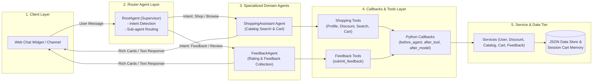

# Sporting Goods Multi-Agent Shopping & Feedback Assistant

A multi-agent conversational application for a sporting goods storefront (shoes, apparel, equipment) built on **Customer Experience Agent Studio (CX Agent Studio)** — part of **Gemini Enterprise for Customer Experience** — and managed programmatically using **`cxas-scrapi`** (`GoogleCloudPlatform/cxas-scrapi`).

---

## 🌟 Overview & Key Features

The application features a **Multi-Agent Router Architecture** driven by natural-language XML instructions, Python code tools, execution callbacks, dynamic session variables, and a pluggable service abstraction layer:

- **Root Router Agent (`RootAgent`)**: Central supervisor that detects customer intent and routes between shopping discovery and customer feedback.
- **Shopping Assistant (`ShoppingAssistant`)**: Greets members, surfaces membership-tier discounts, searches product catalogs based on natural-language queries, and manages session shopping carts.
- **Customer Feedback Agent (`FeedbackAgent`)**: Collects 1 to 5 star ratings and customer feedback comments, logging them into analytics.
- **Membership Discount Engine**: Automatically applies member discounts (**Gold: 15%**, **Silver: 10%**, **Bronze: 5%**, **Guest: 0%**) to product prices and cart totals.
- **Server-Side Pricing Math**: Uses `after_tool_callback` Python hooks to calculate exact float arithmetic for cart subtotals, discount amounts, and grand totals server-side.
- **Rich Response Widgets**: Renders product recommendations and cart line items as structured, image-bearing Info Card UI widgets.
- **Service Abstraction Layer**: Data access is isolated behind `IUserService`, `IDiscountService`, `ICatalogService`, `ICartService`, and `IFeedbackService` interfaces — currently backed by mock JSON files, ready to swap for real REST/OpenAPI backends.
- **CI/CD & Environment Promotion**: Fully configured GitHub Actions workflows for continuous integration quality gates (`.github/workflows/ci.yml`) and multi-environment deployment (`.github/workflows/cd.yml`).

---

## 🏗️ Architecture Diagram



---

## 📁 Repository Structure

```
ShoppingAssistantAgent/
├── Shopping-Assistant-Agent-PRD.md  # Product Requirements Document
├── Shopping-Assistant-Agent-TDD.md  # Technical Design Document (TDD v2.1)
├── README.md                        # Project Documentation
├── app.json                         # CX Agent Studio Application Manifest (RootAgent)
├── pyproject.toml                   # Project dependencies and test config
├── gecx-config.toml                 # Multi-Environment Deployment Profiles (dev, staging, prod)
├── .github/
│   └── workflows/
│       ├── ci.yml                   # CI Quality Gate (cxas lint, validate_schemas, pytest, evals)
│       └── cd.yml                   # CD Deployment (GCP Workload Identity promotion)
├── agents/
│   ├── RootAgent/
│   │   ├── RootAgent.json           # RootAgent manifest & sub-agent bindings
│   │   └── instruction.txt          # Supervisor routing system prompt (<role>, <step>)
│   ├── ShoppingAssistant/
│   │   ├── ShoppingAssistant.json   # ShoppingAssistant manifest & tools
│   │   └── instruction.txt          # Product discovery & cart prompt (<role>, <step>)
│   └── FeedbackAgent/
│       ├── FeedbackAgent.json       # FeedbackAgent manifest & tools
│       └── instruction.txt          # Feedback collection prompt (<role>, <step>)
├── tools/
│   ├── get_user_profile/
│   │   ├── get_user_profile.json    # CXAS Tool Manifest (pythonFunction)
│   │   └── python_function/
│   │       └── python_code.py       # Python Tool implementation
│   ├── get_discount/
│   │   ├── get_discount.json
│   │   └── python_function/python_code.py
│   ├── search_catalog/
│   │   ├── search_catalog.json
│   │   └── python_function/python_code.py
│   ├── add_to_cart/
│   │   ├── add_to_cart.json
│   │   └── python_function/python_code.py
│   ├── get_cart/
│   │   ├── get_cart.json
│   │   └── python_function/python_code.py
│   ├── remove_from_cart/
│   │   ├── remove_from_cart.json
│   │   └── python_function/python_code.py
│   ├── submit_feedback/
│   │   ├── submit_feedback.json
│   │   └── python_function/python_code.py
│   └── end_session/
│       └── end_session.json        # CXAS Client Tool Manifest (clientFunction)
├── callbacks/
│   ├── before_agent.py              # Hook: Context seeding from channel payload
│   ├── after_tool.py                # Hook: Server-side cart arithmetic & feedback state
│   ├── before_tool.py               # Hook: Argument sanitization
│   └── after_model.py               # Hook: Rich Info Card payload formatting
├── services/
│   ├── interfaces.py                # Abstract Base Classes for services
│   ├── user_service.py              # User service implementation
│   ├── discount_service.py          # Discount service implementation
│   ├── catalog_service.py           # Product catalog service implementation
│   ├── cart_service.py              # Session cart service implementation
│   └── feedback_service.py          # Customer feedback service implementation
├── data/
│   ├── mock_users.json              # Mock user profile database
│   ├── membership_discounts.json    # Membership tier discount mapping
│   ├── mock_catalog.json            # Mock product catalog with images
│   └── mock_feedback.json           # Persistent feedback store
├── evals/
│   ├── test_cases.json              # Evaluation simulation test suite
│   └── run_evals.py                 # cxas-scrapi simulation runner
├── tests/
│   └── test_services.py             # Unit test suite (unittest)
└── scripts/
    ├── validate_schemas.py          # Schema & manifest validation script
    ├── build_app.py                 # cxas-scrapi multi-environment deployer
    ├── deploy_to_gcp_live.py        # Programmatic agent initialization script
    └── test_interactive_session.py  # Interactive multi-agent demo simulation
```

---

## 🛠️ CXAS Platform Architecture & Self-Contained Python Tools

### 1. Isolated Google Cloud Execution Sandbox
In **Gemini Enterprise for Customer Experience (CX Agent Studio / CES API)**, Python tools defined via `pythonFunction` run in an isolated execution sandbox hosted on Google Cloud.
- **Self-Contained Tool Requirement**: Tool source files (`tools/<tool_name>/python_function/python_code.py`) MUST be self-contained and use standard Python libraries (`typing`, `json`, `datetime`, `random`, `math`). External local module imports (such as `from services...`) cause GCP's Python parser to fail with `400 Bad Request: No module named 'services'`, which prevents tools from being registered in Agent Studio.
- **Embedded Mock Data**: Tools include inline mock data fallback structures for catalog, user profile, discount rates, cart memory, and feedback logging to ensure 100% standalone reliability on GCP while maintaining compatibility with local unit test suites.

### 2. Automated Multi-Step Deployment Pipeline (`scripts/build_app.py`)
Deploying an application via `python scripts/build_app.py --env <dev|staging|prod>` (or via GitHub Actions CD) executes a two-stage process:
1. **Application ZIP Push (`cxas push`)**: Package and push the application manifest (`app.json`), agent configurations (`RootAgent`, `ShoppingAssistant`, `FeedbackAgent`), and instruction prompts (`instruction.txt`) to the target app path.
2. **Tool Creation & Agent Binding Sync**: Programmatically compile each self-contained Python tool, register the tool resource on GCP, and bind tool lists to `ShoppingAssistant` (6 shopping tools) and `FeedbackAgent` (`submit_feedback`).

---

## 🚀 Quick Start & Local Setup

### 1. Prerequisites
- Python `3.10` or higher
- Git
- `astral-uv`

### 2. Installation
Clone the repository and initialize the virtual environment:
```bash
uv venv --python 3.10
uv pip install -e .
```

---

## 🧪 Testing & Verification

### Run CXAS Deterministic Linter
Validates directory layout, protobuf schemas, tool configurations, and prompt structure (Target: 0 errors):
```bash
uv run cxas lint
```

### Run Schema & Manifest Validation
Validates `app.json`, agent JSON manifests, `instruction.txt` files, and JSON data files:
```bash
uv run python scripts/validate_schemas.py
```

### Run Unit Test Suite
Executes unit tests for services, tools, and callback logic:
```bash
uv run python -m unittest discover tests/
```

### Run Automated Simulation Evaluations
Executes multi-turn conversation simulations covering tier discount greetings, catalog searches, server-side cart arithmetic, and feedback submissions:
```bash
uv run python evals/run_evals.py
```

### Run Interactive Multi-Agent Demo
Simulates an interactive customer turn-by-turn conversation:
```bash
uv run python scripts/test_interactive_session.py
```

---

## 🔐 Keyless Authentication Setup (GCP Workload Identity Federation)

To enable automated CD deployment via GitHub Actions without storing long-lived service account keys:

```bash
# 1. Set variables
export PROJECT_ID="ecom-cx-agent"
export REPO="Sunilrana1978/ShoppingAssistantagent"
export SA_NAME="github-actions-deployer"
export POOL_NAME="github-pool"
export PROVIDER_NAME="github-provider"

# 2. Get GCP Project Number
export PROJECT_NUM=$(gcloud projects describe $PROJECT_ID --format="value(projectNumber)")

# 3. Create Service Account & Grant IAM Roles
gcloud iam service-accounts create $SA_NAME --project=$PROJECT_ID --display-name="GitHub Actions Deployer"
gcloud projects add-iam-policy-binding $PROJECT_ID --member="serviceAccount:${SA_NAME}@${PROJECT_ID}.iam.gserviceaccount.com" --role="roles/dialogflow.admin"
gcloud projects add-iam-policy-binding $PROJECT_ID --member="serviceAccount:${SA_NAME}@${PROJECT_ID}.iam.gserviceaccount.com" --role="roles/aiplatform.admin"

# 4. Create Workload Identity Pool & OIDC Provider
gcloud iam workload-identity-pools create $POOL_NAME --project=$PROJECT_ID --location="global" --display-name="GitHub Actions Pool"

gcloud iam workload-identity-pools providers create-oidc $PROVIDER_NAME \
    --project=$PROJECT_ID --location="global" --workload-identity-pool=$POOL_NAME \
    --display-name="GitHub Provider" \
    --attribute-mapping="google.subject=assertion.sub,attribute.actor=assertion.actor,attribute.repository=assertion.repository" \
    --attribute-condition="assertion.repository == '$REPO'" \
    --issuer-uri="https://token.actions.githubusercontent.com"

# 5. Bind Service Account to GitHub Repository
gcloud iam service-accounts add-iam-policy-binding "${SA_NAME}@${PROJECT_ID}.iam.gserviceaccount.com" \
    --project=$PROJECT_ID \
    --role="roles/iam.workloadIdentityUser" \
    --member="principalSet://iam.googleapis.com/projects/${PROJECT_NUM}/locations/global/workloadIdentityPools/${POOL_NAME}/attribute.repository/${REPO}"

# 6. Set GitHub Repository Secrets
gh secret set GCP_SA_EMAIL --body "${SA_NAME}@${PROJECT_ID}.iam.gserviceaccount.com" --repo $REPO
gh secret set GCP_WIF_PROVIDER --body "projects/${PROJECT_NUM}/locations/global/workloadIdentityPools/${POOL_NAME}/providers/${PROVIDER_NAME}" --repo $REPO
```

---

## 🚢 Deployment to GCP (`ecom-cx-agent`, region: `us`)

### Method 1: Automated Deployment via GitHub Actions (Recommended)
- **Deploy to STAGING**: Merge your Pull Request or push commits to `main`. GitHub Actions automatically authenticates via WIF and deploys to `ecom-cx-agent` (`shopping-assistant-app-staging`).
- **Deploy to PRODUCTION**: Create a Git release tag (e.g., `git tag v1.0.0 && git push origin v1.0.0`). GitHub Actions automatically deploys to `ecom-cx-agent` (`shopping-assistant-app-prod`).

### Method 2: Deployment via Terminal CLI / Script
```bash
# 1. Authenticate with Google Cloud
gcloud auth application-default login
gcloud config set project ecom-cx-agent

# 2. (Optional) Initialize the live Agent in your GCP console
uv run python scripts/deploy_to_gcp_live.py

# 3. Deploy to DEV environment
uv run python scripts/build_app.py --env dev
# or: uv run cxas push --to projects/ecom-cx-agent/locations/us/apps/shopping-assistant-app-dev

# 4. Deploy to STAGING environment
uv run python scripts/build_app.py --env staging
# or: uv run cxas push --to projects/ecom-cx-agent/locations/us/apps/shopping-assistant-app-staging

# 4. Deploy to PROD environment
uv run python scripts/build_app.py --env prod
# or: uv run cxas push --to projects/ecom-cx-agent/locations/us/apps/shopping-assistant-app-prod
```

---

## 📝 Document References
- [Product Requirements Document (PRD)](file:///Users/sunilkumar/gcp/ShoppingAssistantAgent/Shopping-Assistant-Agent-PRD.md)
- [Technical Design Document (TDD v2.1)](file:///Users/sunilkumar/gcp/ShoppingAssistantAgent/Shopping-Assistant-Agent-TDD.md)

