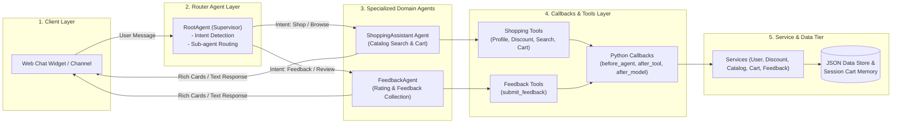
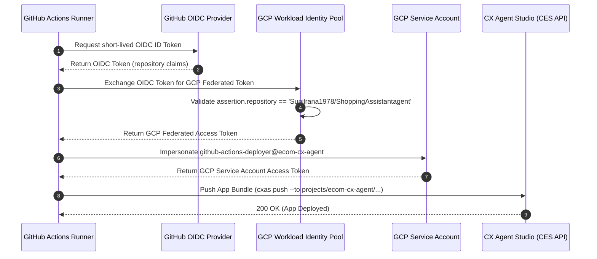

# Technical Design Document (TDD): Multi-Agent Sporting Goods Application

**Document Version:** 2.1  
**Date:** July 24, 2026  
**Author:** Antigravity (Pair Programming with User)  
**PRD Reference:** [Shopping-Assistant-Agent-PRD.md](file:///Users/sunilkumar/gcp/ShoppingAssistantAgent/Shopping-Assistant-Agent-PRD.md)  
**Target Platform:** CX Agent Studio (Gemini Enterprise for Customer Experience)  
**SDK & CLI Tooling:** `cxas-scrapi` (`GoogleCloudPlatform/cxas-scrapi`)  

---

## 1. System Overview & Multi-Agent Architecture

The application is structured as a **Multi-Agent System** within **CX Agent Studio**. A central **`RootAgent`** acts as the conversational supervisor/router that directs incoming user requests to specialized domain agents:
1. **`RootAgent` (Router Agent)**: Determines user intent (shopping vs feedback) and routes control to the appropriate sub-agent.
2. **`ShoppingAssistant` (Domain Agent)**: Handles product discovery, membership discount greetings, catalog search, and session cart management.
3. **`FeedbackAgent` (Domain Agent)**: Collects customer ratings (1–5 stars), detailed feedback comments, and logs feedback entries.

### 1.1 Multi-Agent Architecture Diagram



---

## 2. Directory & Project Structure (`cxas-scrapi` / CES API)

```
ShoppingAssistantAgent/
├── Shopping-Assistant-Agent-PRD.md
├── Shopping-Assistant-Agent-TDD.md
├── README.md
├── app.json                       # Application Manifest declaring RootAgent
├── pyproject.toml                 # Project configuration
├── gecx-config.toml               # Multi-environment target app configurations
├── .github/
│   └── workflows/
│       ├── ci.yml                 # Multi-agent CI quality gate
│       └── cd.yml                 # Keyless WIF multi-agent CD deployment pipeline
├── agents/
│   ├── RootAgent/
│   │   ├── RootAgent.json         # Root Agent definition (PascalCase)
│   │   └── instruction.txt        # Routing system prompt (<role>, <context>, <step>)
│   ├── ShoppingAssistant/
│   │   ├── ShoppingAssistant.json # Shopping Assistant definition
│   │   └── instruction.txt        # Product & Cart system prompt (<role>, <context>, <step>)
│   └── FeedbackAgent/
│       ├── FeedbackAgent.json     # Feedback Agent definition
│       └── instruction.txt        # Feedback collection system prompt (<role>, <context>, <step>)
├── tools/
│   ├── get_user_profile/
│   │   ├── get_user_profile.json  # CXAS Tool Manifest (pythonFunction)
│   │   └── python_function/
│   │       └── python_code.py     # Python Tool Implementation
│   ├── get_discount/
│   │   ├── get_discount.json
│   │   └── python_function/python_code.py
│   ├── search_catalog/
│   │   ├── search_catalog.json
│   │   └── python_function/python_code.py
│   ├── add_to_cart/
│   │   ├── add_to_cart.json
│   │   └── python_function/python_code.py
│   ├── get_cart/
│   │   ├── get_cart.json
│   │   └── python_function/python_code.py
│   ├── remove_from_cart/
│   │   ├── remove_from_cart.json
│   │   └── python_function/python_code.py
│   ├── submit_feedback/
│   │   ├── submit_feedback.json
│   │   └── python_function/python_code.py
│   └── end_session/
│       └── end_session.json      # CXAS Client Tool Manifest (clientFunction)
├── callbacks/
│   ├── before_agent.py
│   ├── after_tool.py
│   ├── before_tool.py
│   └── after_model.py
├── services/
│   ├── interfaces.py              # IUserService, IDiscountService, ICatalogService, ICartService, IFeedbackService
│   ├── user_service.py
│   ├── discount_service.py
│   ├── catalog_service.py
│   ├── cart_service.py
│   └── feedback_service.py
├── data/
│   ├── mock_users.json
│   ├── membership_discounts.json
│   ├── mock_catalog.json
│   └── mock_feedback.json
├── evals/
│   ├── test_cases.json            # Evals covering router, shopping, and feedback
│   └── run_evals.py
└── scripts/
    ├── build_app.py
    └── validate_schemas.py
```

---

## 3. CXAS Platform Standards & Schema Technical Rules

To ensure 100% compatibility with Gemini Enterprise for Customer Experience (`ces.googleapis.com`), the application adheres to the following structural and schema rules:

### 3.1 Tool Manifest Schema (`google.cloud.ces.v1beta.Tool`)
- **Directory Layout**: Each tool is encapsulated inside `tools/<tool_name>/<tool_name>.json`.
- **Proto Field Constraints**: The `description` field MUST be placed inside the `pythonFunction` or `clientFunction` sub-object, NOT at the top level of `Tool`.
- **Type-Safe Function Parameters**: Tool function parameters MUST use type-matching defaults (`size: str = ""`, `price_max: float = 0.0`) instead of `None` defaults, as `None` defaults are silently dropped during import.
- **Deterministic Error Recovery**: Tool implementations return an `agent_action` error dictionary key on exception handling to allow standard LLM recovery:
  ```python
  return {
      "status": "error",
      "agent_action": "Unable to fetch user profile for " + str(user_id) + ": " + str(e)
  }
  ```

### 3.2 Agent Manifest & Naming Standards (`google.cloud.ces.v1beta.Agent`)
- **PascalCase Identifiers**: Root supervisor agent is named **`RootAgent`** to align with CES agent resource resolution and `rootAgent` declaration in `app.json`.
- **Clean Field Schema**: Non-proto keys such as `instructionsFile` or `variablesFile` are omitted from agent JSON files.
- **Instruction Prompt Formats**: System instructions live in `agents/<AgentName>/instruction.txt` and must contain structured XML sections:
  - `<role>`: Concise agent role statement.
  - `<persona>`: Comprehensive tone and behavior instructions.
  - `<context>`: Dynamic system context (including `{current_date}`).
  - `<taskflow>`: Enclosed in `<step name="...">` elements for deterministic task flow control.

---

## 4. Keyless Authentication & CI/CD Pipeline Architecture

Deployment automation uses keyless **Google Cloud Workload Identity Federation (WIF)** over OpenID Connect (OIDC).



### 4.1 Workload Identity Pool & Provider Specification
- **GCP Project**: `ecom-cx-agent` (Project Number: `331751626808`)
- **Service Account**: `github-actions-deployer@ecom-cx-agent.iam.gserviceaccount.com`
- **IAM Roles**: `roles/dialogflow.admin`, `roles/aiplatform.admin`
- **Workload Identity Pool**: `github-pool`
- **Workload Identity Provider**: `projects/331751626808/locations/global/workloadIdentityPools/github-pool/providers/github-provider`
- **Repository Condition**: `assertion.repository == 'Sunilrana1978/ShoppingAssistantagent'`

---

## 5. Summary & Sign-Off Matrix

| Role | Name | Status | Date |
|---|---|---|---|
| Lead Architect | Antigravity AI | Approved | July 24, 2026 |
| Product Owner | Sunil Kumar | Approved | July 24, 2026 |
