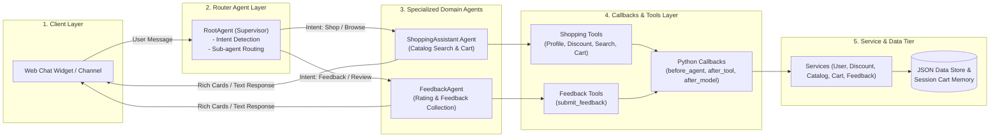

# Technical Design Document (TDD): Multi-Agent Sporting Goods Application

**Document Version:** 2.0  
**Date:** July 23, 2026  
**Author:** Antigravity (Pair Programming with User)  
**PRD Reference:** [Shopping-Assistant-Agent-PRD.md](file:///Users/sunilkumar/gcp/ShoppingAssistantAgent/Shopping-Assistant-Agent-PRD.md)  
**Target Platform:** CX Agent Studio (Gemini Enterprise for Customer Experience)  
**SDK & CLI Tooling:** `cxas-scrapi` (`GoogleCloudPlatform/cxas-scrapi`)  

---

## 1. System Overview & Multi-Agent Architecture

The application is structured as a **Multi-Agent System** within **CX Agent Studio**. A central **`RootAgent`** acts as the conversational supervisor/router that directs incoming user requests to specialized domain agents:
1. **`RootAgent` (Router Agent)**: Determines user intent (shopping vs feedback) and routes control to the appropriate sub-agent.
2. **`ShoppingAssistant` (Domain Agent)**: Handles product discovery, membership discount greetings, catalog search, and session cart management.
3. **`FeedbackAgent` (Domain Agent)**: Collects customer ratings (1–5 stars), detailed feedback comments, and logs feedback entries.

### 1.1 Multi-Agent Architecture Diagram



---

## 2. Directory & Project Structure (`cxas-scrapi`)

```
ShoppingAssistantAgent/
├── Shopping-Assistant-Agent-PRD.md
├── Shopping-Assistant-Agent-TDD.md
├── app.json                       # Application Manifest declaring RootAgent, ShoppingAssistant, FeedbackAgent
├── pyproject.toml                 # Project configuration
├── .github/
│   └── workflows/
│       ├── ci.yml                 # Multi-agent CI quality gate
│       └── cd.yml                 # Multi-agent CD deployment pipeline
├── environments/
│   ├── dev.environment.json
│   ├── staging.environment.json
│   └── prod.environment.json
├── agents/
│   ├── root_agent/
│   │   ├── agent.json             # Root Agent definition
│   │   ├── instructions.xml       # Routing system instructions
│   │   └── variables.json         # Routing state variables
│   ├── shopping_assistant/
│   │   ├── agent.json             # Shopping Assistant definition
│   │   ├── instructions.xml       # Product & Cart system instructions
│   │   └── variables.json         # Shopping state variables
│   └── feedback_agent/
│       ├── agent.json             # Feedback Agent definition
│       ├── instructions.xml       # Feedback collection system instructions
│       └── variables.json         # Feedback state variables
├── tools/
│   ├── get_user_profile.py
│   ├── get_discount.py
│   ├── search_catalog.py
│   ├── add_to_cart.py
│   ├── get_cart.py
│   ├── remove_from_cart.py
│   └── submit_feedback.py         # NEW: Feedback collection tool
├── callbacks/
│   ├── before_agent.py
│   ├── after_tool.py
│   ├── before_tool.py
│   └── after_model.py
├── services/
│   ├── interfaces.py              # Added IFeedbackService
│   ├── user_service.py
│   ├── discount_service.py
│   ├── catalog_service.py
│   ├── cart_service.py
│   └── feedback_service.py        # NEW: Feedback service implementation
├── data/
│   ├── mock_users.json
│   ├── membership_discounts.json
│   ├── mock_catalog.json
│   └── mock_feedback.json         # NEW: Mock feedback store
├── evals/
│   ├── test_cases.json            # Evals covering router, shopping, and feedback
│   └── run_evals.py
└── scripts/
    ├── build_app.py
    └── validate_schemas.py
```

---

## 3. Feedback Data Schema & Tool Specification

### 3.1 `mock_feedback.json` Schema
```json
[
  {
    "feedback_id": "fb_1001",
    "user_id": "u_1029",
    "rating": 5,
    "comments": "Great recommendations and instant discount!",
    "timestamp": "2026-07-23T22:30:00Z"
  }
]
```

### 3.2 `submit_feedback` Tool Interface
```python
# tools/submit_feedback.py
from typing import Dict, Any, Optional

def submit_feedback(
    user_id: str,
    rating: int,
    comments: Optional[str] = None
) -> Dict[str, Any]:
    """Submit customer rating (1 to 5 stars) and optional feedback comments."""
    ...
```

---

## 4. Multi-Agent Routing Specification

### 4.1 `RootAgent` Instructions (`agents/root_agent/instructions.xml`)
- Welcomes customer and checks user intent.
- Transfers to `ShoppingAssistant` if the user wants to browse products, ask about shoes/apparel, or manage cart.
- Transfers to `FeedbackAgent` if the user wants to leave feedback, rate their experience, or file a suggestion.

### 4.2 `FeedbackAgent` Instructions (`agents/feedback_agent/instructions.xml`)
- Prompts user for a rating (1 to 5 stars) and optional comments.
- Invokes `submit_feedback` tool to persist feedback.
- Thanks user warmly and offers transfer back to `ShoppingAssistant` or main menu.

---

## 5. Summary & Sign-Off Matrix

| Role | Name | Status | Date |
|---|---|---|---|
| Lead Architect | Antigravity AI | Approved | July 23, 2026 |
| Product Owner | Sunil Kumar | Pending Review | July 23, 2026 |
